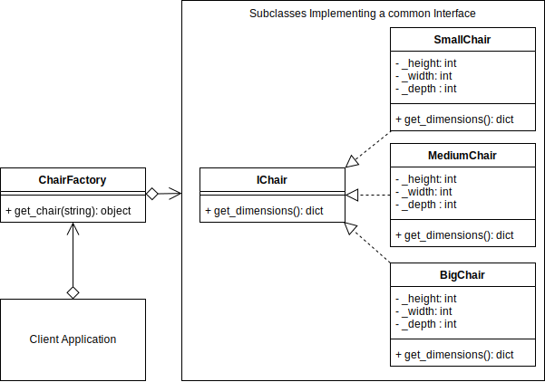

# Factory Design Pattern

## Factory Example UML Diagram



## Overview

- Factory Method is a creational design pattern that provides an interface for creating objects in a superclass, but allows subclasses to alter the type of objects that will be created.

## When to Use

- when you don’t know beforehand the exact types and dependencies of the objects your code should work with.

- when you want to provide users of your library or framework with a way to extend its internal components.

- when you want to save system resources by reusing existing objects instead of rebuilding them each time.

## Pros 

- You avoid tight coupling between the creator and the concrete products.
- Single Responsibility Principle. You can move the product creation code into one place in the program, making the code easier to support.
- Open/Closed Principle. You can introduce new types of products into the program without breaking existing client code.

## Cons
- The code may become more complicated since you need to introduce a lot of new subclasses to implement the pattern. The best case scenario is when you’re introducing the pattern into an existing hierarchy of creator classes.

## Output

```bash
python ./factory/factory_concept.py
ConcreteProductB
```
