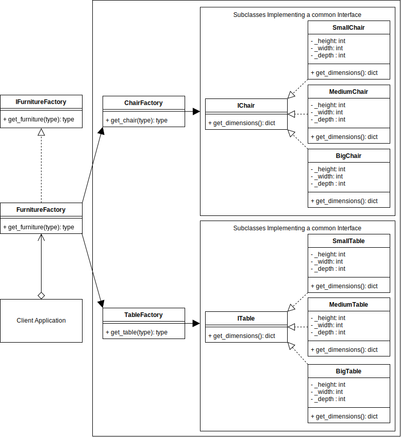

# Abstract Factory Design Pattern
===========================

## Abstract Factory Example UML Diagram

See this UML diagram of an Abstract Furniture Factory implementation that returns chairs and tables.



## Overview

- Abstract Factory is a creational design pattern that lets you produce families of related objects without specifying their concrete classes.

## When to Use

- when your code needs to work with various families of related products, but you don’t want it to depend on the concrete classes of those products—they might be unknown beforehand or you simply want to allow for future extensibility.

- when you have a class with a set of Factory Methods that blur its primary responsibility.


## Pros 

- You can be sure that the products you’re getting from a factory are compatible with each other.
- You avoid tight coupling between concrete products and client code.
- Single Responsibility Principle. You can extract the product creation code into one place, making the code easier to support.
- Open/Closed Principle. You can introduce new variants of products without breaking existing client code.

## Cons
-  The code may become more complicated than it should be, since a lot of new interfaces and classes are introduced along with the pattern.


## Output

``` bash
python ./abstract_factory/abstract_factory_concept.py
<class 'factory_a.ConcreteProductB'>
<class 'factory_b.ConcreteProductC'>
```