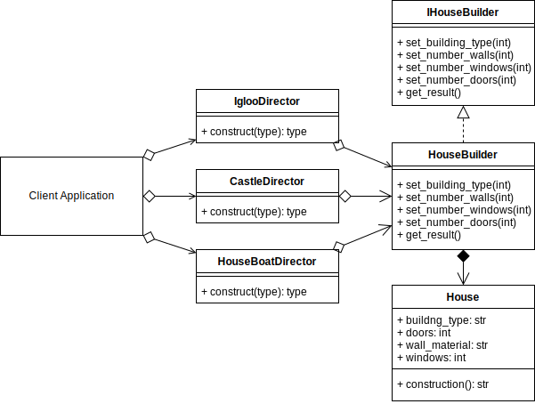

# Builder Design Pattern

## Example UML Diagram




## Overview

- Builder is a creational design pattern that lets you construct complex objects step by step. The pattern allows you to produce different types and representations of an object using the same construction code.

## When to Use

- to get rid of a “telescoping constructor”.
- when you want your code to be able to create different representations of some product (for example, stone and wooden houses).
- to construct Composite trees or other complex objects.

## Pros 

- You can construct objects step-by-step, defer construction steps or run steps recursively.
- You can reuse the same construction code when building various representations of products.
- Single Responsibility Principle. You can isolate complex construction code from the business logic of the produ

## Cons
-  The overall complexity of the code increases since the pattern requires creating multiple new classes.


## Output

``` bash
python ./builder/builder_concept.py
['a', 'b', 'c']
```