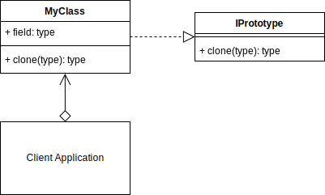

# Prototype Design Pattern

## Prototype UML Diagram

## Overview

- Prototype is a creational design pattern that lets you copy existing objects without making your code dependent on their classes.

## When to Use

- when your code shouldn’t depend on the concrete classes of objects that you need to copy.
- when you want to reduce the number of subclasses that only differ in the way they initialize their respective objects.

## Pros 

- You can clone objects without coupling to their concrete classes.
- You can get rid of repeated initialization code in favor of cloning pre-built prototypes.
- You can produce complex objects more conveniently.
- You get an alternative to inheritance when dealing with configuration presets for complex objects.

## Cons
-  Cloning complex objects that have circular references might be very tricky.
