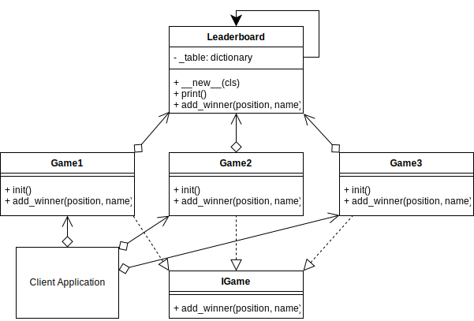

# Singleton Design Pattern

## Example UML Diagram



## Overview

- Singleton is a creational design pattern that lets you ensure that a class has only one instance, while providing a global access point to this instance.

## When to Use

- when a class in your program should have just a single instance available to all clients; for example, a single database object shared by different parts of the program.
- when you need stricter control over global variables.

## Pros 

- You can be sure that a class has only a single instance.
- You gain a global access point to that instance.
- The singleton object is initialized only when it’s requested for the first time.

## Cons
- Violates the Single Responsibility Principle. The pattern solves two problems at the time.
- The pattern requires special treatment in a multithreaded environment so that multiple threads won’t create a singleton object several times.
- It may be difficult to unit test the client code of the Singleton because many test frameworks rely on inheritance when producing mock objects. 


## Output

``` bash
python ./singleton/singleton_concept.py
id(Singleton)   = 2164775087968
id(OBJECT1)     = 2164775087968
id(OBJECT2)     = 2164775087968
id(OBJECT3)     = 2164775087968
```