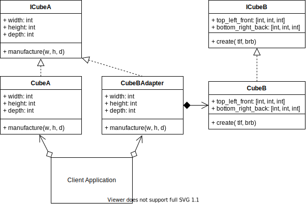

# Adapter Design Pattern

## Example UML Diagram



## Overview

- Adapter is a structural design pattern that allows objects with incompatible interfaces to collaborate.

## When to Use

- when you want to use some existing class, but its interface isn’t compatible with the rest of your code.

- when you want to reuse several existing subclasses that lack some common functionality that can’t be added to the superclass.


## Pros 

- Single Responsibility Principle. You can separate the interface or data conversion code from the primary business logic of the program.
- Open/Closed Principle. You can introduce new types of adapters into the program without breaking the existing client code, as long as they work with the adapters through the client interface.

## Cons
- The overall complexity of the code increases because you need to introduce a set of new interfaces and classes.

## Output

``` bash
python ./adapter/adapter_concept.py
method A
method B
method A
method B
```

