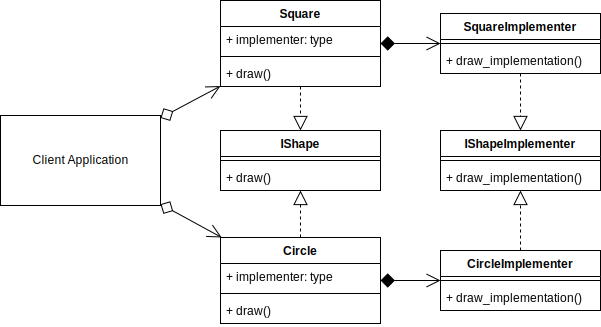

# Bridge Design Pattern

## Example UML Diagram



## Overview

- Bridge is a structural design pattern that lets you split a large class or a set of closely related classes into two separate hierarchies—abstraction and implementation—which can be developed independently of each other.

## When to Use

- when you want to divide and organize a monolithic class that has several variants of some functionality
- when you need to extend a class in several orthogonal (independent) dimensions.
- If you need to be able to switch implementations at runtime.

## Pros 

- You can create platform-independent classes and apps.
- The client code works with high-level abstractions. It isn’t exposed to the platform details.
- Open/Closed Principle. You can introduce new abstractions and implementations independently from each other.
- Single Responsibility Principle. You can focus on high-level logic in the abstraction and on platform details in the implementation.

## Cons

- You might make the code more complicated by applying the pattern to a highly cohesive class.

## Output

``` bash
python ./bridge/bridge_concept.py
('a', 'b', 'c')
a
b
c
```