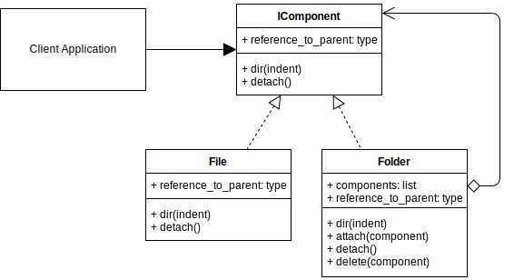

# Composite Design Pattern


## Composite Example UML Diagram



## Overview

- Composite is a structural design pattern that lets you compose objects into tree structures and then work with these structures as if they were individual objects.

## When to Use

- when you have to implement a tree-like object structure.
- when you want the client code to treat both simple and complex elements uniformly.

## Pros 

- You can work with complex tree structures more conveniently: use polymorphism and recursion to your advantage.
- Open/Closed Principle. You can introduce new element types into the app without breaking the existing code, which now works with the object tree.

## Cons

- It might be difficult to provide a common interface for classes whose functionality differs too much. In certain scenarios, you’d need to overgeneralize the component interface, making it harder to comprehend.

## Output

``` bash
python ./composite/composite_concept.py

LEAF_A          id:2050574298848
LEAF_B          id:2050574298656
COMPOSITE_1     id:2050574298272
COMPOSITE_2     id:2050574298128

<Leaf>          id:2050574298656        Parent: None
<Composite>     id:2050574298128        Parent: None    Components:2
<Leaf>          id:2050574298848        Parent: 2050574298128
<Composite>     id:2050574298272        Parent: 2050574298128   Components:0
```


